# How Lido for Polygon works

From the user perspective, Lido for Polygon user interface will be accessible at https://polygon.lido.fi.

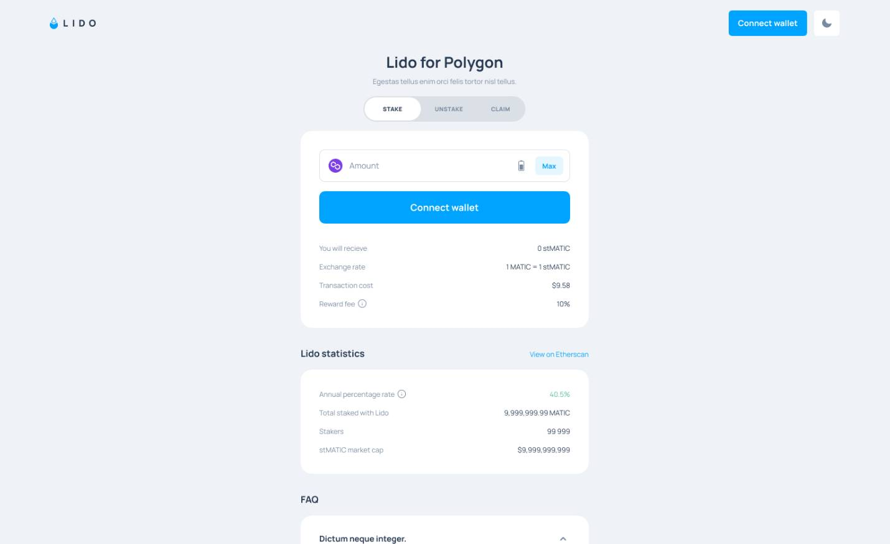

### Stake Tokens
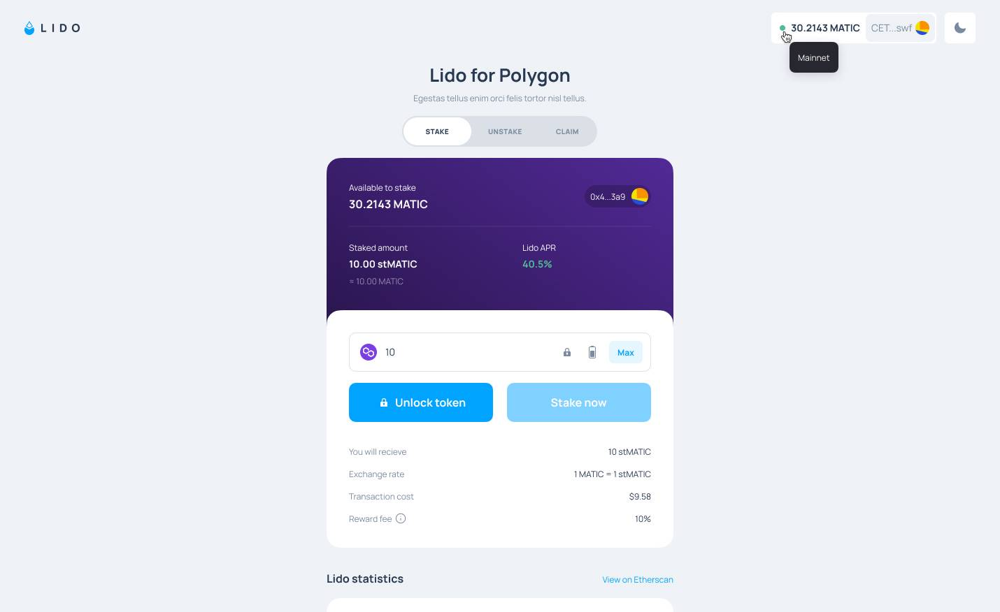
The first step for users to take when trying stake their MATIC in the Lido for Polygon protocol is to `unlock` their
tokens. The unlock process approves the StMatic contract to spend the amount to be staked from the user's balance. To unlock
tokens, click on the `unlock` button and confirm the transaction in the confirmation page that shows up.

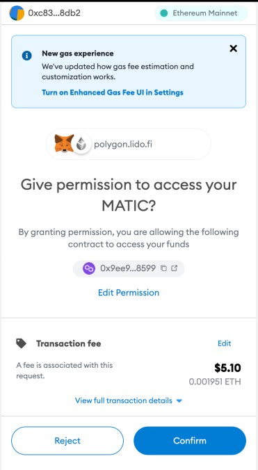

After confirmation, the user needs to wait for the process to be complete and a success dialog box saying `xMATIC unlocked`
would be displayed on the screen.

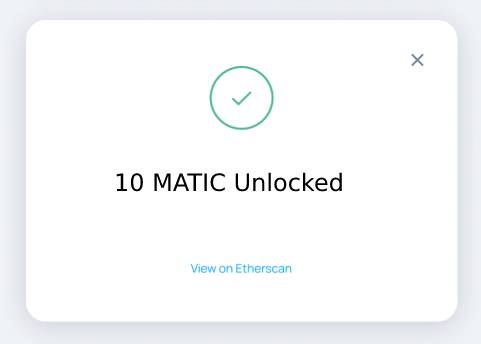

To complete the staking process, click on `Stake now` on the app and confirm the transaction in the confirmation page that shows up.

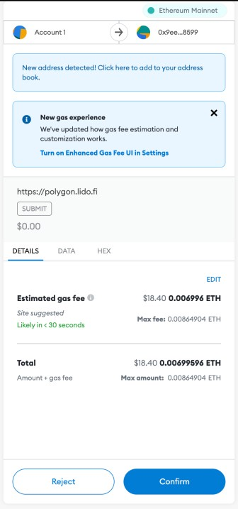

After confirmation, the user needs to wait for the process to be complete and a success dialog box saying `Stake successful`
would be displayed on the screen.

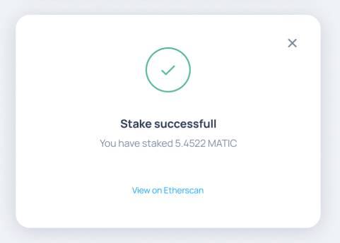

The Lido for Polygon protocol receives submitted MATIC tokens, calculates the current ratio between MATIC and stMATIC tokens 
and sends that amount of stMATIC to the user. Since stMATIC is a non-rebasable token, user will always have the same 
amount. During time, while rewards are accumulated, the value of stMATIC token increases. MATIC tokens are then 
delegated across Polygon validators that are part of Lido for Polygon protocol.

Accumulated rewards are redistributed once a day between node operators (5%), Lido DAO (2.5%) and the Treasury (2.5%).

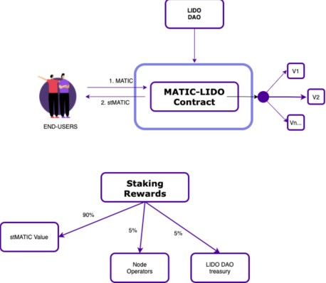

### Unstake Tokens
To unstake your staked tokens from the network, click on the unstake tab on the app and input the amount of StMatic to
unstake from the protocol and click on the `Unlock tokens` button. 

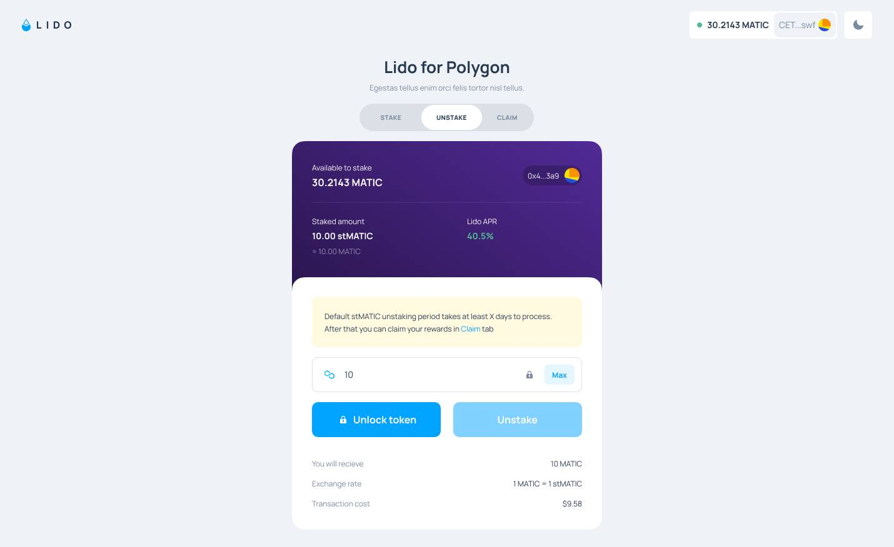

Upon clicking the `Unlock tokens` button, confirm the transaction on the confirmation page from your wallet to approve 
unlocking some StMatic tokens. The unlocking process approves the StMatic contract to spend from your StMatic token.

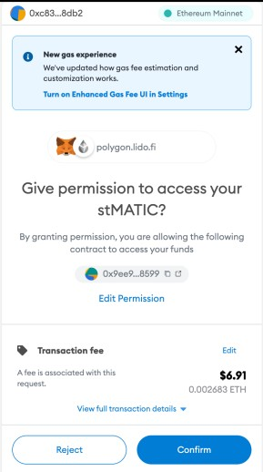

After confirming unlock transaction, a confirmation dialog displays on the app. To complete the unstaking process, click
on the `Unstake` button that is now visible on the app. 

After clicking the `Unstake` button, confirm the transaction on the confirmation page that appears from your wallet.

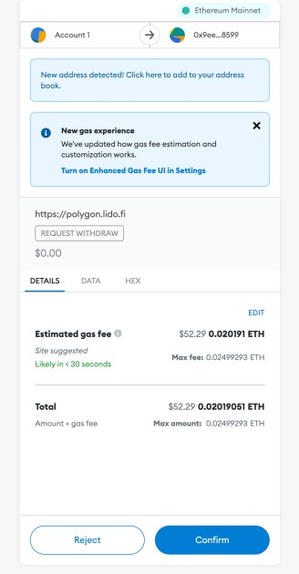

After confirming the transaction, wait a little time for the transaction to be completed. The app will display a dialog
with a success message after the transaction is confirmed. Upon unstaking, user submits his stMATIC tokens, receives a 
NFT token as a voucher for MATIC token claim after the un-bonding period (approximately 9 days). 

### Claim Tokens
After the un-bonding period, a user will be able to submit his NFT to Lido for Polygon, NFT gets burned and user receives his MATIC.
To claim your tokens, click on the claim tab on the app and click on the `claim` button. 

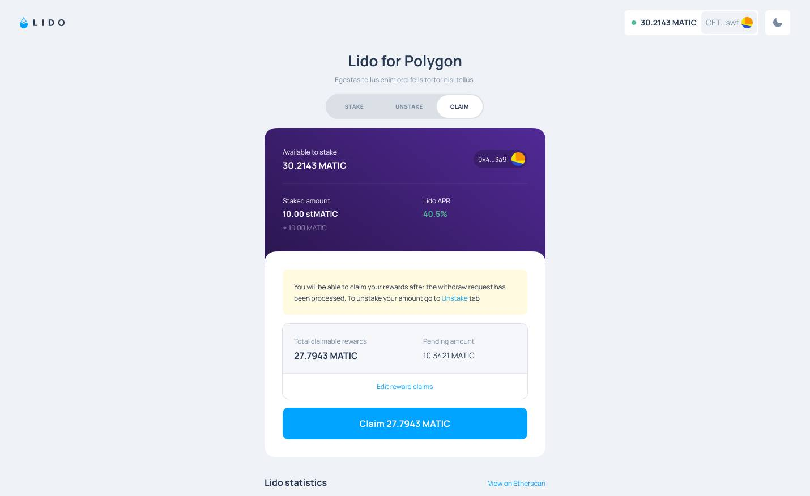

On the confirmation page that appears, confirm the transaction.

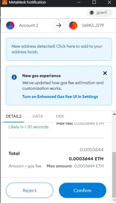

On confirming the transaction, a dialog will display indicating that the claim process is in progress. 

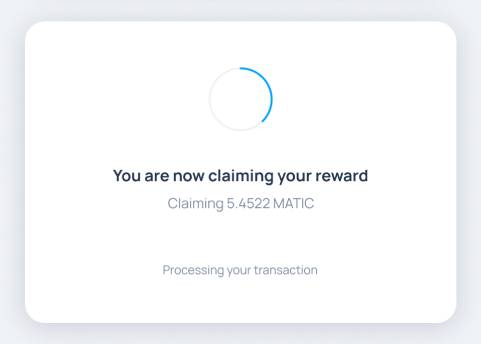

After confirmation, the app displays a dialog with the message `Reward claimed`, and the user gets their MATIC tokens in
their wallet. 

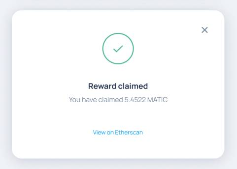

